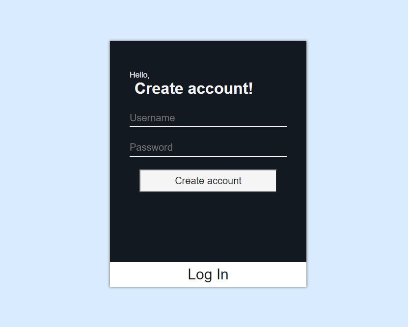
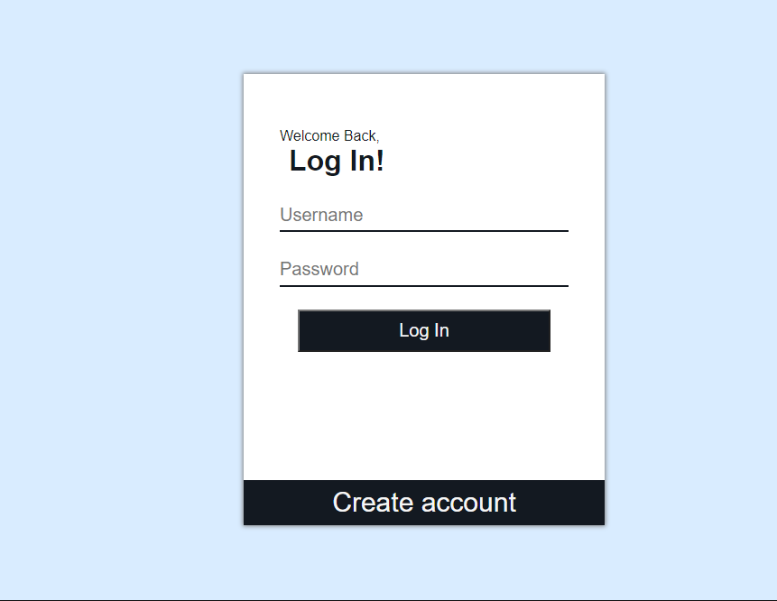

# NodeJs-Service
A node js service which listens to incoming data via socket, computes it and outputs it in json via Websocket protocol.And the output displayed on a web app.

## [`Live Demo`](https://devilzer.github.io/Frontend-NJS-Emitter/)
## [`Video Walkthru`](https://drive.google.com/file/d/1-z9O3xCUQrrJC5iqYvFNo4CpCzqa6cPe/view?usp=sharing)

## [`Frontend-NJS-Emitter github`](https://github.com/Devilzer/Frontend-NJS-Emitter)
## [`Backend-NJS-Listner-socket github`](https://github.com/Devilzer/Backend-NJS-Listner-socket)

## Features

* User can register/login.
* Object hashing using `SHA-256` (checking data integrity).
* Data encryption using`aes-256-ctr` algorithm.
* Data visualization Frontend.
* Data store in MongoDB based on time interval.
* Data search.

## How to install and run?
### client( front-end )
1. Clone the frontend form above link.
2. Install all dependencies by `npm install`
3. `npm start`

### server( back-end )
1. Clone the backend form above link.
2. Install all dependencies by `npm install`
3. Config MongoDB by adding your db connect url in `/config/mongoose.js`
4. `npm start`

## App Overview.

#### Sign-up page.
 

#### Sign-in page.
 

#### Details page.
Data visualization.
 

### Frontend
`components` Contains all the React components. 
`redux` Contains Redux State mangement files (acitons,reducers). 
`style` Contains SCSS file for App styling. 

### Backend
This project follows MVC Structure. 
`config` Contains config files for js libries used in project. 
`models` Contains different database models. 
